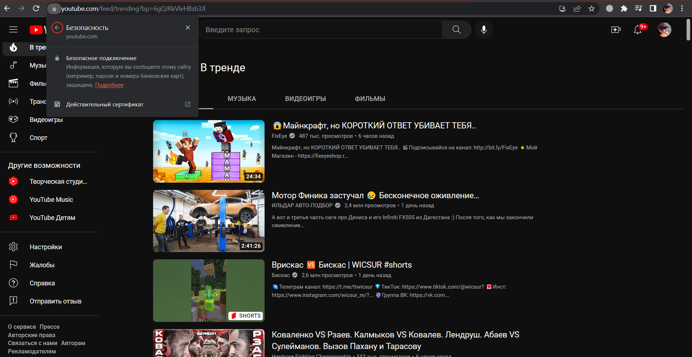
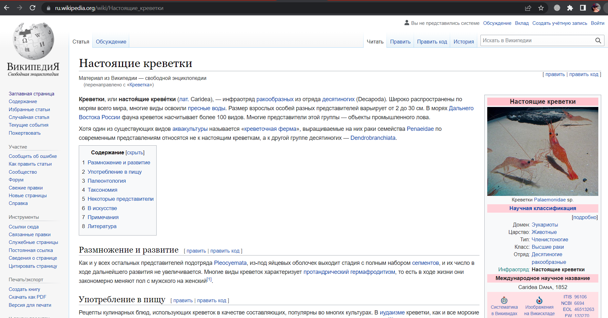
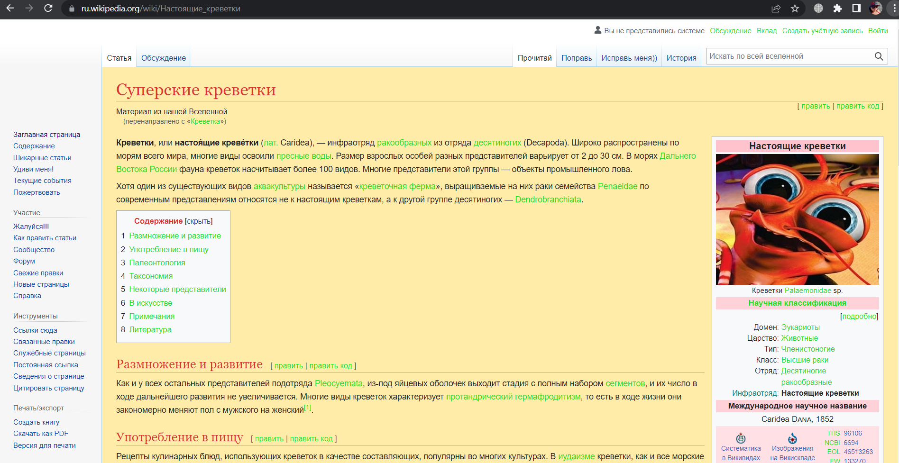
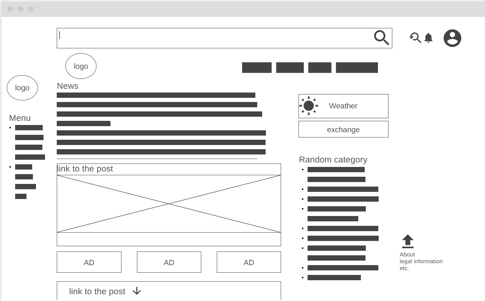

## Домашняя работа #1

**Задание 1.** Определите, на каком протоколе работает сайт youtube.com
* Протокол: *HTTPS*

**Задание 2.** Создайте файл 2_analyze.txt, в котором проанализируйте структуру страницы сайта <https://ru.wikipedia.org/>, а именно нужно описать (коротко, своими словами), какие блоки есть на сайте, что в этих блоках находится. Есть ли на сайте шапка, подвал, что в них содержится? Как и где расположен контент? Есть ли дополнительные элементы на странице?  
* [Анализ](2_analyze.txt)

**Задание 3.** Внесите не менее 10 изменений на страницу любой статьи сайта <https://ru.wikipedia.org/>, с помощью инструмента разработчика и представьте два скриншота было/стало (скриншоты должны иметь названия 3_before.jpg, 3_after.jpg соответственно). Желательно поработать с изменением текста на странице, заменой картинки, изменением стилей.
1. Изменен текст заголовка
2. Изменен цвет заголовка
3. Изменен текс поиска
4. Изменена фотография
5. Изменен текст в правых вкладках
6. Изменен цвет ссылок
7. Изменен цвет фона основного блока
8. Удален логотип
9. Изменены пункты меню справа
10. Изменена приписка под заголовком
*   
* 

**Задание 4.** Создайте прототип низкой детализации сайта <https://dzen.ru/> с помощью сайта <https://wireframe.cc/>. Предоставьте скриншот того, что получилось (скриншот должен быть назван 4_proto.jpg).  
* 